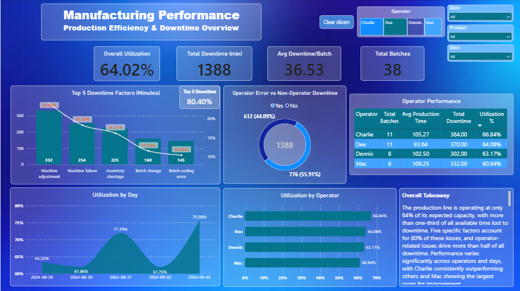

# Manufacturing Line Productivity & Downtime Analysis

## Overview

This project analyzes manufacturing line productivity, production efficiency, batch-time performance, operator variation, and downtime using production and operational data.

SQL was used as the primary analytical tool, Python was used for data validation and preparation, and Power BI was used to develop the final interactive dashboard.

The objective was to identify operational inefficiencies, major downtime contributors, and areas for improvement.

---

## Business Problem

Production batches were taking longer than standard expectations. Downtime was affecting manufacturing capacity. Some products experienced higher production-time overruns than others. Operator performance appeared to vary. Management needed visibility into the main causes of inefficiency.

The analysis was designed to answer the following business questions:

1. What is the overall production efficiency of the manufacturing line?
2. Which products have the largest production-time overruns?
3. Which downtime factors contribute most to lost production time?
4. Which products are most affected by downtime?
5. Are certain operators associated with higher production-time variance?
6. Which production areas should be prioritized for improvement?

---

## Dataset

The dataset covers production activity recorded between **August 29, 2024 and September 3, 2024**.

| Item               | Count |
| ------------------ | ----: |
| Production batches |    38 |
| Downtime records   |    61 |
| Products           |     6 |
| Downtime factors   |    12 |

**Source:** Manufacturing production data (Excel/CSV)

**Prepared datasets:** `line_productivity_prepared.csv`, `line_downtime_prepared.csv`, `products.csv`, `downtime_factors.csv`

For detailed field definitions, see [`documentation/data_dictionary.md`](documentation/data_dictionary.md).

---

## Analytical Approach

The project follows an end-to-end analytical workflow:

```text
Raw Data
   ↓
Data Validation
   ↓
Data Preparation
   ↓
SQLite Database
   ↓
SQL Analysis
   ↓
Python Validation
   ↓
Power BI Modeling
   ↓
KPI Development
   ↓
Insights & Recommendations
```

| Tool       | Purpose                   |
| ---------- | ------------------------- |
| Excel/CSV  | Source data               |
| Python     | Validation & preparation  |
| SQLite     | Analytical database       |
| SQL        | Primary analysis          |
| Power BI   | Dashboard & visualization |
| Git/GitHub | Project version control   |

---

## Key KPIs

| KPI                           |        Result |
| ----------------------------- | ------------: |
| Total Batches                 |            38 |
| Overall Utilization           |        64.02% |
| Total Downtime                | 1,388 minutes |
| Average Downtime per Batch    | 36.53 minutes |
| Operator Error %              |        55.91% |
| Top 5 Downtime Contribution % |        80.40% |
| Average Time Variance         | 36.53 minutes |
| Average Time Variance %       |        56.17% |

For detailed KPI definitions and formulas, see [`documentation/kpi_definitions.md`](documentation/kpi_definitions.md).

---

## Key Findings

### Finding 1 — Production Time Is Significantly Above Standard

The average actual batch time was **101.53 minutes**, compared with an average standard time of **65.00 minutes**.

This represents an average time variance of **36.53 minutes**, or **56.17% above the standard production time**.

### Finding 2 — Machine Adjustment Is the Largest Downtime Factor

The top three downtime factors account for over 58% of all recorded downtime:

| Rank | Downtime Factor    | Total Downtime |
| ---: | ------------------ | -------------: |
|    1 | Machine Adjustment |    332 minutes |
|    2 | Machine Failure    |    254 minutes |
|    3 | Inventory Shortage |    225 minutes |

### Finding 3 — Downtime Is Concentrated in Specific Products

| Rank | Product | Total Downtime |
| ---: | ------- | -------------: |
|    1 | CO-600  |    494 minutes |
|    2 | CO-2L   |    277 minutes |
|    3 | RB-600  |    258 minutes |

### Finding 4 — Operator Differences Require Context

Operator-level differences were identified, but these should not be interpreted as direct evidence of individual performance problems. Product mix, batch volume, machine conditions, and downtime can influence the observed results.

For detailed findings with evidence and business implications, see [`insights/key_findings.md`](insights/key_findings.md).

---

## Business Recommendations

The recommended priority order for investigation is:

| Priority | Area                     | Focus                                         |
| -------: | ------------------------ | --------------------------------------------- |
|        1 | Machine Adjustment       | Standardize and reduce adjustment time        |
|        2 | Machine Failure          | Investigate recurring equipment failures      |
|        3 | Inventory Shortage       | Improve material availability                 |
|        4 | CO-600                   | Analyze product-specific downtime             |
|        5 | Production-Time Variance | Identify sources of actual-vs-standard gap    |
|        6 | Operator Variation       | Investigate standard work and process factors |

For detailed recommendations with actions and expected benefits, see [`insights/business_recommendations.md`](insights/business_recommendations.md).

For a management summary, see [`insights/executive_summary.md`](insights/executive_summary.md).

---

## Power BI Dashboard

The Power BI dashboard provides an interactive view of:

* Production volume
* Production efficiency
* Batch-time performance
* Operator variation
* Downtime analysis
* Product-level performance

**Dashboard file:** [`powerbi/Manufacturing-Line-Productivity-Downtime-Analysis.pbix`](powerbi/Manufacturing-Line-Productivity-Downtime-Analysis.pbix)

For detailed dashboard documentation, see [`powerbi/README.md`](powerbi/README.md).

---

## Dashboard Preview

### 01 — Executive Overview



### 02 — Downtime Analysis


### 03 — Operator & Product Performance


---

## Project Structure

```text
02-Manufacturing-Line-Productivity-Downtime-Analysis/
│
├── README.md
│
├── dashboard_images/
│   ├── 01_Executive_Overview.png
│   ├── 02_Downtime Analysis.png
│   ├── 03_Operator & Product Performance.png
│   ├── 04_Batch Detail.png
│   └── 05_Final Recommendations.png
│
├── data/
│   ├── raw/
│   │   ├── data_dictionary.csv
│   │   └── Manufacturing_Line_Productivity.xlsx
│   │
│   └── processed/
│       ├── downtime_factors.csv
│       ├── line_downtime_prepared.csv
│       ├── line_productivity_prepared.csv
│       └── products.csv
│
├── database/
│   └── manufacturing_analysis.db
│
├── documentation/
│   ├── data_dictionary.md
│   ├── data_quality_notes.md
│   ├── kpi_definitions.md
│   └── methodology.md
│
├── insights/
│   ├── business_recommendations.md
│   ├── executive_summary.md
│   └── key_findings.md
│
├── powerbi/
│   ├── Manufacturing-Line-Productivity-Downtime-Analysis.pbix
│   └── README.md
│
├── python/
│   ├── 01_data_validation.py
│   ├── 02_data_preparation.py
│   └── outputs/
│
└── sql/
    ├── README.md
    │
    ├── phase_1_analysis/
    │   ├── 01_production_volume_analysis.sql
    │   ├── 02_production_efficiency_analysis.sql
    │   └── 03_downtime_analysis.sql
    │
    └── phase_2_validation_and_insights/
        ├── 01_overall_production_efficiency.sql
        ├── 02_downtime_concentration.sql
        ├── 03_product_downtime_factors.sql
        ├── 04_highest_batch_time_overruns.sql
        ├── 05_high_overrun_batch_downtime.sql
        ├── 06_operator_production_variance.sql
        ├── 07_overall_utilization.sql
        ├── 08_operator_error%.sql
        └── 09_utilization_by_day.sql
```

---

## Methodology & Documentation

| Document                                                         | Description                                       |
| ---------------------------------------------------------------- | ------------------------------------------------- |
| [Data Dictionary](documentation/data_dictionary.md)              | Field definitions and data model                  |
| [Data Quality Notes](documentation/data_quality_notes.md)        | Assumptions, limitations, and data quality issues |
| [KPI Definitions](documentation/kpi_definitions.md)              | Business logic and formulas for all KPIs          |
| [Methodology](documentation/methodology.md)                      | End-to-end analytical workflow                    |
| [Executive Summary](insights/executive_summary.md)               | Management summary of findings                    |
| [Key Findings](insights/key_findings.md)                         | Detailed evidence-based findings                  |
| [Business Recommendations](insights/business_recommendations.md) | Actionable recommendations                        |
| [SQL Analysis](sql/README.md)                                    | SQL query documentation                           |
| [Power BI Dashboard](powerbi/README.md)                          | Dashboard documentation                           |

---

## Limitations

The project has several important limitations:

* **Short observation period** — The dataset covers only 5 days of production
* **Limited production volume** — Only 38 batches available for analysis
* **Recorded downtime only** — Unrecorded or incorrectly classified downtime cannot be detected
* **No external production context** — Shift, machine condition, maintenance history, and other variables are not available

Results should be treated as an analytical case study rather than a statistically representative model of long-term manufacturing performance. The dashboard identifies **performance patterns for investigation** rather than establishing definitive causality.

---

## Tools & Technologies

* Python / Pandas
* SQLite
* SQL
* Power BI / DAX
* Excel / CSV
* Git / GitHub

---

## Author

**Raziel Rosas Martinez**

Mechanical Engineer | Data Analyst

Skills: SQL · Python · Power BI · Excel · Manufacturing Analytics
